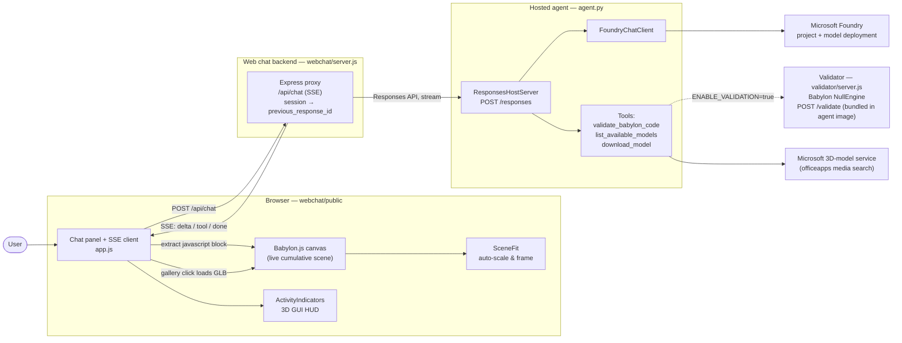
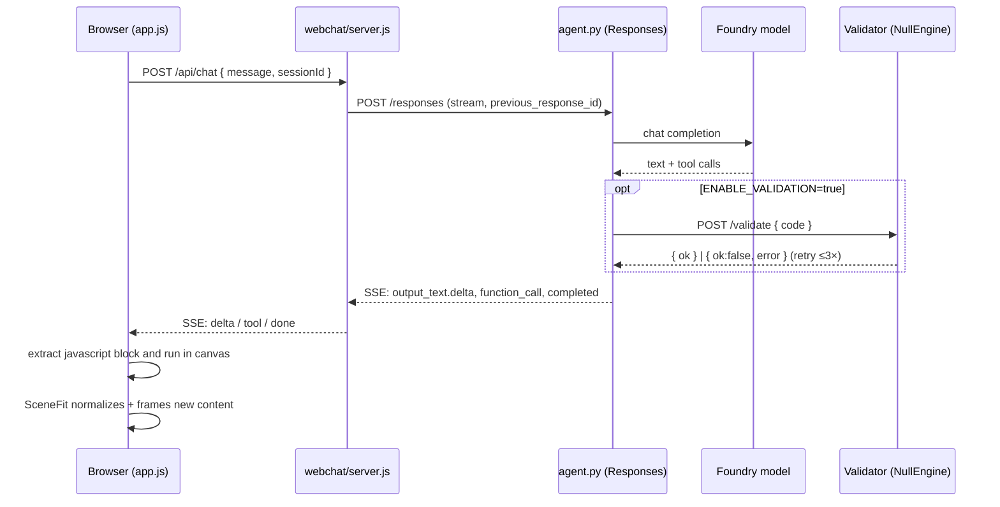

# Verbal Reality

A full-screen Babylon.js canvas (left, 2/3 width) plus a chat panel (right, 1/3) that talks to a
**Microsoft Foundry hosted agent**. The agent turns natural language into Babylon.js JavaScript that
is evaluated live in the canvas, building up a **cumulative** 3D scene one turn at a time. It can also
browse a library of ready-made GLB models and drop them into the scene.

Inspired by [davrous/musicalJARVIB](https://github.com/davrous/musicalJARVIB), but using a Foundry
hosted agent (Microsoft Agent Framework) instead of a direct LLM call, and a custom web chat instead of Teams.

## Features

- **Natural-language scene building** — describe what you want ("a glossy red sphere above a ground
  plane") and the agent writes Babylon.js code that runs immediately in the canvas.
- **Cumulative scene** — every turn adds to the existing scene and can reference meshes created in
  earlier turns by name. `/reset` clears both the canvas and the agent's conversation.
- **3D model library** — the agent can search Microsoft's public 3D-model service and return a
  thumbnail gallery in the chat. Clicking a thumbnail loads that GLB into the scene instantly
  (client-side), then silently tells the agent the model's name so follow-ups like "make it bigger"
  keep working.
- **Automatic sizing & framing** — [`SceneFit`](webchat/public/scenefit.js) measures each turn's new
  content, rescales it to a consistent canonical size, rests it on the ground, and frames the camera,
  so you never worry about absolute units.
- **Server-side validation (optional)** — when enabled, the agent validates its own generated code in
  a headless Babylon `NullEngine` sandbox and fixes-and-retries (up to 3×) before replying.
- **In-canvas activity HUD** — progress and tool calls are drawn with the Babylon 3D GUI (not DOM
  overlays), so they remain visible inside a future VR session.
- **Live streaming chat** — replies stream token-by-token over Server-Sent Events, with a status pill
  reflecting the agent's current step.

## Architecture

| Component | Path | Stack | Default Port |
|-----------|------|-------|--------------|
| Hosted agent | [agent.py](agent.py) | Python · Microsoft Agent Framework · `FoundryChatClient` + `ResponsesHostServer` (OpenAI Responses API at `POST /responses`) | 8088 |
| Validator (optional) | [validator/server.js](validator/server.js) | Node.js · Express · Babylon.js `NullEngine` (headless) | 8087 |
| Web chat backend | [webchat/server.js](webchat/server.js) | Node.js · Express proxy (SSE) + static file server | 3000 |
| Web chat front-end | [webchat/public/](webchat/public/) | Babylon.js (CDN) · [`app.js`](webchat/public/app.js) (chat + scene) · [`scenefit.js`](webchat/public/scenefit.js) (auto-scale) · [`activity.js`](webchat/public/activity.js) (3D HUD) | — |



**Validation flag** — generated code is validated server-side, never in the browser:

- `ENABLE_VALIDATION=true` → the agent calls the Node.js `/validate` tool (headless `NullEngine`)
  before replying, and retries (up to 3×) if the generated code throws.
- `ENABLE_VALIDATION=false` → the LLM's code is returned directly with no validation.

The web chat client is intentionally unaware of validation — it just renders prose, executes the
returned `javascript` code blocks, and renders any `models` gallery block.

### Request flow



## Prerequisites

- Python 3.10+, Node.js 18+
- Azure CLI logged in for local dev: `az login` (the agent uses `DefaultAzureCredential`)
- A Microsoft Foundry project endpoint + a deployed model

## Setup

1. **Configure environment**

   ```bash
   cp .env.sample .env
   # then edit .env and set PROJECT_ENDPOINT (and adjust the model / flags if needed)
   ```

2. **Python agent** (always use the virtual environment)

   ```bash
   python3 -m venv .venv
   source .venv/bin/activate
   pip install --pre -r requirements.txt
   ```

   > Stack note: this uses `agent-framework` + `agent-framework-foundry-hosting`
   > (`FoundryChatClient` + `ResponsesHostServer`). `--pre` is required because
   > `agent-framework-foundry-hosting` only ships pre-release builds today. We do **not**
   > use `AzureAIClient`/`azure-ai-agentserver-*`: that client registers a `kind: prompt`
   > agent that collides with the hosted agent in [agent.yaml](agent.yaml) (HTTP 400
   > "Agent kind mismatch"). The agent's name lives only in `agent.yaml`.

3. **Node services**

   ```bash
   (cd validator && npm install)
   (cd webchat   && npm install)
   ```

## Run (local)

Start in this order:

1. **Validator** (only needed when `ENABLE_VALIDATION=true`)

   ```bash
   cd validator && npm start          # -> http://localhost:8087
   ```

2. **Agent** — press <kbd>F5</kbd> in VS Code and pick
   **"Debug Local Agent/Workflow HTTP Server"** (Foundry Toolkit experience). It starts the agent on
   `http://localhost:8088`, opens the Agent Inspector, and (via tasks) launches the validator for you.

   Or run it manually:

   ```bash
   source .venv/bin/activate
   python agent.py                    # HTTP server (default) -> http://localhost:8088/responses
   python agent.py --cli              # interactive terminal chat instead
   ```

3. **Web chat**

   ```bash
   cd webchat && npm start            # -> http://localhost:3000
   ```

Open http://localhost:3000 and start describing the 3D scene you want.

## Deploy (hosted agent)

[agent.yaml](agent.yaml) declares the hosted-agent identity (`kind: hosted`, name
`verbalreality`, Responses protocol) and [Dockerfile](Dockerfile) packages the agent.
The agent's name is defined **only** in `agent.yaml` — never in `Agent(...)` — which is
why server-side registration of a `kind: prompt` agent must be avoided.

Server-side validation **is** available in production: the image bundles both runtimes —
the Python agent (Responses API on 8088) and the Node.js Babylon `NullEngine` validator
(`/validate` on 8087) — and [start.sh](start.sh) launches the validator in the background,
waits for it to become healthy, then execs the agent. `agent.yaml` therefore sets
`ENABLE_VALIDATION=true` and points `VALIDATOR_URL` at `http://localhost:8087/validate`.
Foundry runs a single container per hosted agent, so co-hosting the validator (rather than
running it as a separate service) is what keeps validation working once deployed.

Build and push the image to ACR, then create/update the agent (see the Foundry hosted-agent
deploy workflow). Use cloud build if you don't have Docker locally:

```bash
az acr build --registry <acr-name> --image verbalreality:$(date +%Y%m%d%H%M) \
  --platform linux/amd64 --source-acr-auth-id "[caller]" --file Dockerfile .
```

## Usage tips

- Each request adds to the existing scene (cumulative). Type `/reset` in the chat to clear both the
  canvas and the agent conversation.
- Ask the agent to **find real models** ("find a chair", "show me some dinosaurs") to get a thumbnail
  gallery in the chat; click a thumbnail to drop that GLB into the scene instantly. Follow up in
  natural language ("make it twice as big", "rotate it") and the agent remembers the loaded mesh.
- Drag the divider on the chat's left border to resize the chat panel.
- <kbd>Enter</kbd> sends, <kbd>Shift</kbd>+<kbd>Enter</kbd> inserts a newline.

## Configuration reference (`.env`)

| Variable | Purpose | Default |
|----------|---------|---------|
| `PROJECT_ENDPOINT` | Foundry project endpoint | _(required)_ |
| `MODEL_DEPLOYMENT_NAME` | Model deployment name | `gpt-4.1` |
| `ENABLE_VALIDATION` | Toggle the NullEngine validation tool | `true` |
| `VALIDATOR_URL` | Validator endpoint used by the agent tool | `http://localhost:8087/validate` |
| `PORT` | Port the agent's Responses server listens on | `8088` |
| `MODEL_SEARCH_URL` | Microsoft 3D-model search endpoint used by `list_available_models` | _(officeapps media search)_ |
| `MODEL_SEARCH_PAGE_SIZE` | Max models returned per library search | `5` |

The web chat backend also honors `PORT` and `AGENT_MODEL`
(see [webchat/server.js](webchat/server.js)). The validator honors `PORT`
(see [validator/server.js](validator/server.js)).

### Switching between the local and hosted agent

The chat header has an agent selector so you can route requests to either the **local**
agent or the **deployed Foundry hosted** agent without restarting anything:

| Variable | Purpose | Default |
|----------|---------|---------|
| `LOCAL_AGENT_ENDPOINT` | Local agent Responses URL (legacy alias: `AGENT_ENDPOINT`) | `http://localhost:8088/responses` |
| `REMOTE_AGENT_PROJECT_ENDPOINT` | Foundry project endpoint (`https://<resource>.services.ai.azure.com/api/projects/<project>`) | falls back to `PROJECT_ENDPOINT` |
| `REMOTE_AGENT_NAME` | Deployed hosted agent name (from [agent.yaml](agent.yaml)) | _(unset → remote disabled)_ |
| `REMOTE_AGENT_API_VERSION` | Data-plane api-version | `2025-11-15-preview` |
| `REMOTE_AGENT_ENDPOINT` | Optional full Responses URL override (wins over the two above) | _(unset)_ |
| `REMOTE_AGENT_SCOPE` | Token scope for the remote agent | `https://ai.azure.com/.default` |

The **local** target needs no auth. The **Foundry (remote)** target is enabled when the web
chat can build the Responses URL — i.e. a project endpoint (`REMOTE_AGENT_PROJECT_ENDPOINT`
or `PROJECT_ENDPOINT`) **and** `REMOTE_AGENT_NAME` are set (or you supply an explicit
`REMOTE_AGENT_ENDPOINT`). The backend then attaches an Azure AD bearer token minted
via `DefaultAzureCredential` (run `az login` locally). Each target keeps its **own
conversation thread**, so switching mid-session means the newly selected agent doesn't know
what the other one built — the on-screen 3D scene is preserved either way, and `/reset`
clears both threads.

#### Configure the web chat to connect to the remote Foundry agent

1. **Identify your project endpoint and agent name.** You don't need to hand-build the long
   Responses URL — just provide the two parts and the web chat composes it as
   `<project-endpoint>/agents/<name>/endpoint/protocols/openai/responses?api-version=<ver>`:

   - **Project endpoint** — `https://<your-foundry-resource>.services.ai.azure.com/api/projects/<project>`
     (the same `PROJECT_ENDPOINT` the Python agent uses).
   - **Agent name** — `verbalreality`, from [agent.yaml](agent.yaml).

2. **Set the web chat environment variables.** Add them to your `.env`
   (or export them in the shell that runs the web chat):

   ```bash
   # .env  (read by webchat/server.js)
   # Reuses PROJECT_ENDPOINT automatically; set REMOTE_AGENT_PROJECT_ENDPOINT only to override it.
   REMOTE_AGENT_NAME=verbalreality
   # Optional overrides:
   # REMOTE_AGENT_PROJECT_ENDPOINT=https://<resource>.services.ai.azure.com/api/projects/<project>
   # REMOTE_AGENT_API_VERSION=2025-11-15-preview
   # REMOTE_AGENT_SCOPE=https://ai.azure.com/.default
   ```

   Leave `LOCAL_AGENT_ENDPOINT` unset to keep the local default, or point it elsewhere if
   your local agent runs on a non-default port. If you'd rather pin the exact URL, set
   `REMOTE_AGENT_ENDPOINT` to the full Responses URL — it overrides the composition above.

3. **Authenticate.** The web chat backend mints the bearer token with
   `DefaultAzureCredential`, so sign in with an identity that has access to the Foundry
   project:

   ```bash
   az login
   ```

   Your identity needs a role that allows invoking the project's agents (e.g. **Azure AI
   User** / **Azure AI Developer** on the Foundry project). Without it the remote calls
   return `401`/`403`.

4. **Start (or restart) the web chat** so it picks up the new env vars:

   ```bash
   cd webchat && npm start
   ```

   On startup it logs both targets, e.g.
   `remote agent -> https://…/agents/verbalreality/responses`.

5. **Select the target in the UI.** Open http://localhost:3000 and pick **Foundry (remote)**
   from the selector in the chat header. (If the option shows *“not configured”*, the server
   couldn't build the Responses URL — set `REMOTE_AGENT_NAME` and ensure a project endpoint
   is available (`PROJECT_ENDPOINT` or `REMOTE_AGENT_PROJECT_ENDPOINT`), then restart.)

You can confirm the backend's view at any time:

```bash
curl -s http://localhost:3000/api/config
# {"localConfigured":true,"remoteConfigured":true}
```

If a remote request fails with an auth error, the chat surfaces a message telling you to run
`az login` or check `REMOTE_AGENT_SCOPE`.
