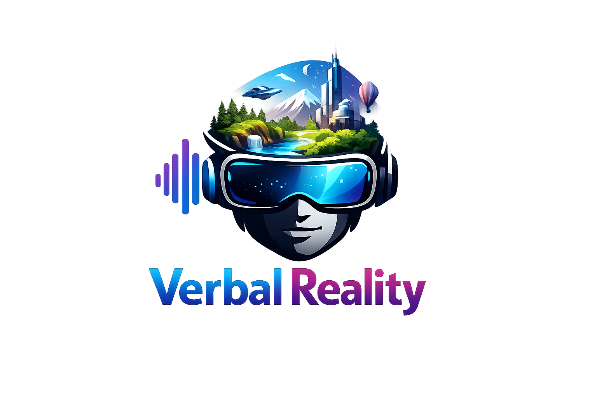
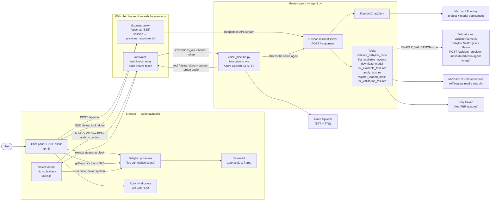
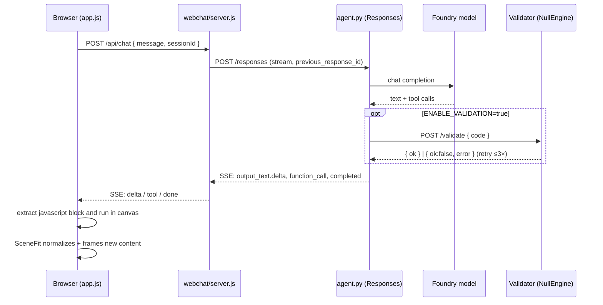

# Verbal Reality

A full-screen Babylon.js canvas (left, 2/3 width) plus a chat panel (right, 1/3) that talks to a
**Microsoft Foundry hosted agent**. The agent turns natural language into Babylon.js JavaScript that
is evaluated live in the canvas, building up a **cumulative** 3D scene one turn at a time. It can also
browse a library of ready-made GLB models and drop them into the scene, and dress meshes with free
PBR textures from [Poly Haven](https://polyhaven.com/).

Inspired by [davrous/musicalJARVIB](https://github.com/davrous/musicalJARVIB), but using a Foundry
hosted agent (Microsoft Agent Framework) instead of a direct LLM call, and a custom web chat instead of Teams.

## Features

- **Natural-language scene building** — describe what you want ("a glossy red sphere above a ground
  plane") and the agent writes Babylon.js code that runs immediately in the canvas.
- **Cumulative scene** — every turn adds to the existing scene and can reference meshes created in
  earlier turns by name. `/reset` clears both the canvas and the agent's conversation.
- **3D model library** — the agent can search Microsoft's public 3D-model service and return a
  thumbnail gallery in the chat. Clicking a thumbnail loads that GLB into the scene instantly
  (client-side), then silently tells the agent the model's name so follow-ups like "make it bigger"
  keep working. A `register_loaded_mesh` tool mirrors that client-side load into the validation
  sandbox so later code that references the model by name still validates.
- **Poly Haven textures** — the agent can search [Poly Haven](https://polyhaven.com/) for free PBR
  surface textures (`list_available_textures`) and return a thumbnail gallery in a ```textures block.
  Once you pick one and name a mesh, `apply_texture` resolves the texture's albedo / normal /
  roughness-AO-metalness maps and builds a `BABYLON.PBRMaterial` that is assigned to that mesh (and
  its children, so imported GLB models work too). Clicking a texture thumbnail asks the agent to apply
  it to the relevant mesh. Tiling and resolution (1k–8k) are adjustable.
- **Physics (Havok)** — every scene has the Havok physics engine enabled with gravity, so you can ask
  for things like "drop a bouncing ball onto the ground" and the agent attaches `PhysicsAggregate`
  bodies. Physics is pre-enabled both in the browser and in the validation sandbox.
- **Automatic sizing & framing** — [`SceneFit`](webchat/public/scenefit.js) measures each turn's new
  content, rescales it to a consistent canonical size, rests it on the ground, positions it to avoid
  overlapping existing content, and frames the camera, so you never worry about absolute units.
- **Server-side validation (optional)** — when enabled, the agent validates its own generated code in
  a headless Babylon `NullEngine` sandbox and fixes-and-retries (up to 3×) before replying.
- **Validation-failure capture (optional)** — when `CAPTURE_VALIDATION_FAILURES=true`, every failing
  validate→fix→retry attempt (code + error + originating prompt) is persisted to disk via
  [`failure_store.py`](failure_store.py) and exposed through a `list_validation_failures` tool, so
  failures can be inspected and turned into an evaluation dataset.
- **In-canvas activity HUD** — progress and tool calls are drawn with the Babylon 3D GUI (not DOM
  overlays), so they remain visible inside a future VR session.
- **Live streaming chat** — replies stream token-by-token over Server-Sent Events, with a status pill
  reflecting the agent's current step.
- **Voice control (push-to-talk)** — talk to the agent hands-free. Hold <kbd>V</kbd> on the keyboard
  (or the **B** button on the VR right controller) to speak; release to send. This uses the
  **Foundry-native `invocations_ws` WebSocket protocol** with a cascaded **Azure Speech** pipeline
  (speech-to-text → the same agent → text-to-speech) running inside the agent container. The agent
  speaks **only its prose** — the returned Babylon.js code is stripped before text-to-speech, so it
  still runs in the canvas and stays in the cumulative scene context, but is never read aloud. Voice
  is fully **additive**: text chat, the model/texture galleries, validation retries and the activity
  HUD all keep working unchanged. A 🎙️ toggle in the chat header turns voice mode on/off, and
  barge-in lets you interrupt the agent by starting to talk. In VR the right-controller **A** button
  toggles edit mode (freeing **B** for voice).

## Architecture

| Component | Path | Stack | Default Port |
|-----------|------|-------|--------------|
| Hosted agent | [agent.py](agent.py) | Python · Microsoft Agent Framework · `FoundryChatClient` + `ResponsesHostServer` (OpenAI Responses API at `POST /responses`) | 8088 |
| Voice pipeline (optional) | [voice_pipeline.py](voice_pipeline.py) | Python · `invocations_ws` WebSocket · Azure Speech STT/TTS cascade (co-hosted with the agent) | 8089 |
| Validator (optional) | [validator/server.js](validator/server.js) | Node.js · Express · Babylon.js `NullEngine` (headless) + Havok physics | 8087 |
| Web chat backend | [webchat/server.js](webchat/server.js) | Node.js · Express proxy (SSE) + `/api/voice` WebSocket relay + static file server | 3000 |
| Web chat front-end | [webchat/public/](webchat/public/) | Babylon.js (CDN) · [`app.js`](webchat/public/app.js) (chat + scene) · [`voice.js`](webchat/public/voice.js) (mic + playback) · [`scenefit.js`](webchat/public/scenefit.js) (auto-scale) · [`activity.js`](webchat/public/activity.js) (3D HUD) | — |



**Validation flag** — generated code is validated server-side, never in the browser:

- `ENABLE_VALIDATION=true` → the agent calls the Node.js `/validate` tool (headless `NullEngine`)
  before replying, and retries (up to 3×) if the generated code throws. The sandbox scene is
  cumulative; client-side GLB loads are mirrored into it via `/register-mesh` so later snippets that
  reference a loaded model by name still validate.
- `ENABLE_VALIDATION=false` → the LLM's code is returned directly with no validation.
- `CAPTURE_VALIDATION_FAILURES=true` (independent of the above) → each failed validation attempt is
  persisted to disk for later inspection via the `list_validation_failures` tool.

The web chat client is intentionally unaware of validation — it just renders prose, executes the
returned `javascript` code blocks, and renders any `models` or `textures` gallery block.

### Request flow



## Prerequisites

- Python 3.10+, Node.js 18+
- Azure CLI logged in for local dev: `az login` (the agent uses `DefaultAzureCredential`)
- A Microsoft Foundry project endpoint + a deployed model
- **For voice (optional):** an **Azure AI Services / Speech** resource and a microphone-capable
  browser (Chrome, Edge or Safari). The `invocations_ws` voice protocol is currently in **preview and
  available only in the North Central US region**, so the hosted agent must be deployed there for
  remote voice. See [Voice support](#voice-support-optional) below for the required configuration and
  the **agent-identity role assignment**.

## Setup

1. **Configure environment**

   ```bash
   cp .env.sample .env
   # then edit .env and set PROJECT_ENDPOINT (and adjust the model / flags if needed)
   ```

2. **Python agent** (always use the virtual environment)

   ```bash
   python3 -m venv .venv
   source .venv/bin/activate
   pip install --pre -r requirements.txt
   ```

   > Stack note: this uses `agent-framework` + `agent-framework-foundry-hosting`
   > (`FoundryChatClient` + `ResponsesHostServer`). `--pre` is required because
   > `agent-framework-foundry-hosting` only ships pre-release builds today. We do **not**
   > use `AzureAIClient`/`azure-ai-agentserver-*`: that client registers a `kind: prompt`
   > agent that collides with the hosted agent in [agent.yaml](agent.yaml) (HTTP 400
   > "Agent kind mismatch"). The agent's name lives only in `agent.yaml`.

3. **Node services**

   ```bash
   (cd validator && npm install)
   (cd webchat   && npm install)
   ```

## Run (local)

Start in this order:

1. **Validator** (only needed when `ENABLE_VALIDATION=true`)

   ```bash
   cd validator && npm start          # -> http://localhost:8087
   ```

2. **Agent** — press <kbd>F5</kbd> in VS Code and pick
   **"Debug Local Agent/Workflow HTTP Server"** (Foundry Toolkit experience). It starts the agent on
   `http://localhost:8088`, opens the Agent Inspector, and (via tasks) launches the validator for you.

   Or run it manually:

   ```bash
   source .venv/bin/activate
   python agent.py                    # HTTP server (default) -> http://localhost:8088/responses
   python agent.py --cli              # interactive terminal chat instead
   ```

3. **Web chat**

   ```bash
   cd webchat && npm start            # -> http://localhost:3000
   ```

Open http://localhost:3000 and start describing the 3D scene you want.

## Deploy (hosted agent)

[agent.yaml](agent.yaml) declares the hosted-agent identity (`kind: hosted`, name
`verbalreality`, Responses protocol) and [Dockerfile](Dockerfile) packages the agent.
The agent's name is defined **only** in `agent.yaml` — never in `Agent(...)` — which is
why server-side registration of a `kind: prompt` agent must be avoided.

Server-side validation **is** available in production: the image bundles both runtimes —
the Python agent (Responses API on 8088) and the Node.js Babylon `NullEngine` validator
(`/validate` on 8087) — and [start.sh](start.sh) launches the validator in the background,
waits for it to become healthy, then execs the agent. `agent.yaml` therefore sets
`ENABLE_VALIDATION=true` and points `VALIDATOR_URL` at `http://localhost:8087/validate`.
Foundry runs a single container per hosted agent, so co-hosting the validator (rather than
running it as a separate service) is what keeps validation working once deployed. Because
three runtimes (Python + Node + Babylon/Havok) share the container, `agent.yaml` requests
`2.0` CPU / `4.0Gi` memory, and sets `CAPTURE_VALIDATION_FAILURES=true` so failed attempts
are persisted to the micro-VM disk for later evaluation.

Build and push the image to ACR, then create/update the agent (see the Foundry hosted-agent
deploy workflow). Use cloud build if you don't have Docker locally:

```bash
az acr build --registry <acr-name> --image verbalreality:$(date +%Y%m%d%H%M) \
  --platform linux/amd64 --source-acr-auth-id "[caller]" --file Dockerfile .
```

**Voice in production** — the image also serves the optional `invocations_ws` voice WebSocket
(port 8089) co-hosted with the agent; [agent.yaml](agent.yaml) declares the `invocations_ws` protocol
and the Speech environment variables. Deploy in **North Central US** (the `invocations_ws` preview
region) and grant the agent's **Entra (agent) identity** the **Cognitive Services User** role on the
Speech / AI Services resource — see [Voice support](#voice-support-optional). Voice is optional: with
`ENABLE_VOICE=false` (or no Speech resource configured) the agent runs text-only and nothing else
changes.

## Usage tips

- Each request adds to the existing scene (cumulative). Type `/reset` in the chat to clear both the
  canvas and the agent conversation.
- Ask the agent to **find real models** ("find a chair", "show me some dinosaurs") to get a thumbnail
  gallery in the chat; click a thumbnail to drop that GLB into the scene instantly. Follow up in
  natural language ("make it twice as big", "rotate it") and the agent remembers the loaded mesh.
- Ask the agent to **find textures** ("find a brick texture", "show me some rock surfaces") to get a
  Poly Haven thumbnail gallery; then say which mesh to dress ("put the first brick on the wall",
  "apply that rock to the ground, tiled 6x") and the agent applies it as a PBR material. Clicking a
  texture thumbnail asks the agent to apply it to the relevant mesh.
- Ask for **physics** ("drop a bouncing ball onto the ground", "stack some crates and topple them")
  — the scene already has Havok gravity enabled, so the agent just attaches physics bodies.
- Drag the divider on the chat's left border to resize the chat panel.
- <kbd>Enter</kbd> sends, <kbd>Shift</kbd>+<kbd>Enter</kbd> inserts a newline.
- **Talk to the agent:** turn on voice mode with the 🎙️ header toggle, then hold <kbd>V</kbd> (or the
  VR right-controller **B** button) to speak and release to send. The agent speaks its reply but never
  reads the generated code aloud. See [Voice support](#voice-support-optional) for setup.

## Configuration reference (`.env`)

| Variable | Purpose | Default |
|----------|---------|---------|
| `PROJECT_ENDPOINT` | Foundry project endpoint | _(required)_ |
| `MODEL_DEPLOYMENT_NAME` | Model deployment name | `gpt-4.1` |
| `ENABLE_VALIDATION` | Toggle the NullEngine validation tool | `true` |
| `VALIDATOR_URL` | Validator `/validate` endpoint used by the agent tool | `http://localhost:8087/validate` |
| `VALIDATOR_REGISTER_URL` | Validator `/register-mesh` endpoint (synced from browser GLB loads) | derived from `VALIDATOR_URL` |
| `CAPTURE_VALIDATION_FAILURES` | Persist failed validation attempts for evaluation | `true` |
| `FAILURE_STORE_DIR` | Where captured failures are written | `$HOME/validation_failures` (falls back to `/tmp`) |
| `FAILURE_STORE_MAX_LINES` | Soft cap on `failures.jsonl` length | `500` |
| `LOG_LEVEL` | Python agent log level | `INFO` |
| `PORT` | Port the agent's Responses server listens on | `8088` |
| `MODEL_SEARCH_URL` | Microsoft 3D-model search endpoint used by `list_available_models` | _(officeapps media search)_ |
| `MODEL_SEARCH_PAGE_SIZE` | Max models returned per library search | `5` |
| `POLYHAVEN_API` | Poly Haven asset API used by `list_available_textures` / `apply_texture` | `https://api.polyhaven.com` |
| `TEXTURE_SEARCH_PAGE_SIZE` | Max textures returned per Poly Haven search | `6` |
| `TEXTURE_DEFAULT_RESOLUTION` | Default texture resolution when unspecified (`1k`/`2k`/`4k`/`8k`) | `2k` |
| `ENABLE_VOICE` | Toggle the voice (`invocations_ws` + Azure Speech) pipeline | `true` |
| `SPEECH_REGION` | Azure Speech / AI Services region (must be `northcentralus` for the hosted `invocations_ws` preview) | _(unset → voice off)_ |
| `SPEECH_RESOURCE_ID` | Full ARM resource id of the Speech / AI Services resource, used for **keyless** (Entra ID) auth | _(unset)_ |
| `SPEECH_KEY` | Speech key — only if you prefer key-based auth over keyless | _(unset)_ |
| `SPEECH_ENDPOINT` | Custom Speech endpoint (alternative to region) | _(unset)_ |
| `SPEECH_VOICE_NAME` | Neural voice used for the spoken reply | `en-US-AvaMultilingualNeural` |
| `SPEECH_RECOGNITION_LANGUAGE` | Speech-to-text locale | `en-US` |
| `SPEECH_AAD_SCOPE` | Token scope for keyless Speech auth | `https://cognitiveservices.azure.com/.default` |
| `VOICE_WS_PORT` | Port the agent serves the voice WebSocket on | `8089` |

The web chat backend also honors `PORT` and `AGENT_MODEL`
(see [webchat/server.js](webchat/server.js)). The validator honors `PORT`
(see [validator/server.js](validator/server.js)).

### Switching between the local and hosted agent

The chat header has an agent selector so you can route requests to either the **local**
agent or the **deployed Foundry hosted** agent without restarting anything:

| Variable | Purpose | Default |
|----------|---------|---------|
| `LOCAL_AGENT_ENDPOINT` | Local agent Responses URL (legacy alias: `AGENT_ENDPOINT`) | `http://localhost:8088/responses` |
| `REMOTE_AGENT_PROJECT_ENDPOINT` | Foundry project endpoint (`https://<resource>.services.ai.azure.com/api/projects/<project>`) | falls back to `PROJECT_ENDPOINT` |
| `REMOTE_AGENT_NAME` | Deployed hosted agent name (from [agent.yaml](agent.yaml)) | _(unset → remote disabled)_ |
| `REMOTE_AGENT_API_VERSION` | Data-plane api-version | `2025-11-15-preview` |
| `REMOTE_AGENT_ENDPOINT` | Optional full Responses URL override (wins over the two above) | _(unset)_ |
| `REMOTE_AGENT_SCOPE` | Token scope for the remote agent | `https://ai.azure.com/.default` |

The **local** target needs no auth. The **Foundry (remote)** target is enabled when the web
chat can build the Responses URL — i.e. a project endpoint (`REMOTE_AGENT_PROJECT_ENDPOINT`
or `PROJECT_ENDPOINT`) **and** `REMOTE_AGENT_NAME` are set (or you supply an explicit
`REMOTE_AGENT_ENDPOINT`). The backend then attaches an Azure AD bearer token minted
via `DefaultAzureCredential` (run `az login` locally). Each target keeps its **own
conversation thread**, so switching mid-session means the newly selected agent doesn't know
what the other one built — the on-screen 3D scene is preserved either way, and `/reset`
clears both threads.

#### Configure the web chat to connect to the remote Foundry agent

1. **Identify your project endpoint and agent name.** You don't need to hand-build the long
   Responses URL — just provide the two parts and the web chat composes it as
   `<project-endpoint>/agents/<name>/endpoint/protocols/openai/responses?api-version=<ver>`:

   - **Project endpoint** — `https://<your-foundry-resource>.services.ai.azure.com/api/projects/<project>`
     (the same `PROJECT_ENDPOINT` the Python agent uses).
   - **Agent name** — `verbalreality`, from [agent.yaml](agent.yaml).

2. **Set the web chat environment variables.** Add them to your `.env`
   (or export them in the shell that runs the web chat):

   ```bash
   # .env  (read by webchat/server.js)
   # Reuses PROJECT_ENDPOINT automatically; set REMOTE_AGENT_PROJECT_ENDPOINT only to override it.
   REMOTE_AGENT_NAME=verbalreality
   # Optional overrides:
   # REMOTE_AGENT_PROJECT_ENDPOINT=https://<resource>.services.ai.azure.com/api/projects/<project>
   # REMOTE_AGENT_API_VERSION=2025-11-15-preview
   # REMOTE_AGENT_SCOPE=https://ai.azure.com/.default
   ```

   Leave `LOCAL_AGENT_ENDPOINT` unset to keep the local default, or point it elsewhere if
   your local agent runs on a non-default port. If you'd rather pin the exact URL, set
   `REMOTE_AGENT_ENDPOINT` to the full Responses URL — it overrides the composition above.

3. **Authenticate.** The web chat backend mints the bearer token with
   `DefaultAzureCredential`, so sign in with an identity that has access to the Foundry
   project:

   ```bash
   az login
   ```

   Your identity needs a role that allows invoking the project's agents (e.g. **Azure AI
   User** / **Azure AI Developer** on the Foundry project). Without it the remote calls
   return `401`/`403`.

4. **Start (or restart) the web chat** so it picks up the new env vars:

   ```bash
   cd webchat && npm start
   ```

   On startup it logs both targets, e.g.
   `remote agent -> https://…/agents/verbalreality/responses`.

5. **Select the target in the UI.** Open http://localhost:3000 and pick **Foundry (remote)**
   from the selector in the chat header. (If the option shows *“not configured”*, the server
   couldn't build the Responses URL — set `REMOTE_AGENT_NAME` and ensure a project endpoint
   is available (`PROJECT_ENDPOINT` or `REMOTE_AGENT_PROJECT_ENDPOINT`), then restart.)

You can confirm the backend's view at any time:

```bash
curl -s http://localhost:3000/api/config
# {"localConfigured":true,"remoteConfigured":true,"voiceLocalAvailable":true,"voiceRemoteAvailable":true}
```

If a remote request fails with an auth error, the chat surfaces a message telling you to run
`az login` or check `REMOTE_AGENT_SCOPE`.

## Voice support (optional)

Talk to the agent with **push-to-talk**: hold <kbd>V</kbd> (keyboard) or the VR right-controller **B**
button to speak, release to send. Toggle voice mode with the 🎙️ button in the chat header.

### How it works

Voice uses the **Foundry-native `invocations_ws` WebSocket protocol** (preview) rather than the
text Responses API. The agent container co-hosts a small WebSocket pipeline
([voice_pipeline.py](voice_pipeline.py)) next to the Responses server, sharing the **same** in-process
agent (so all tools, validation and instructions are identical for spoken and typed turns):

```
microphone (16 kHz PCM)  →  Azure Speech STT  →  the agent  →  control frames + Azure Speech TTS
```

- The agent's reply is streamed back as the **same event shapes** the browser already handles for
  typed turns (`tool` / `delta` / `done`), so spoken requests build the scene, render galleries and
  surface validation retries exactly like typed ones.
- **Only the prose is spoken.** Every fenced block (```` ```javascript ````, ```` ```models ````,
  ```` ```textures ````) is stripped server-side before text-to-speech — so the returned Babylon.js
  code still arrives in the browser, runs in the canvas, and stays in the cumulative scene context,
  but is never read aloud.
- The browser cannot set an `Authorization` header on a WebSocket upgrade, so the web chat backend
  relays the browser's voice socket to the upstream endpoint at `/api/voice` and injects the Foundry
  bearer token for the remote target. Audio never touches Azure identity in the browser.
- **Barge-in:** starting to talk while the agent is speaking cancels playback and listens.

Browser support: Chrome, Edge or Safari (microphone capture + Web Audio). The 🎙️ toggle is
disabled automatically if the browser or the server isn't voice-capable.

### Configure voice

1. **Provision / reuse a Speech resource.** Voice needs an **Azure AI Services** (multi-service) or
   **Speech** resource. An existing Foundry **AI Services** resource already includes Speech, so you
   can reuse it — just make sure it is in **North Central US** for the hosted `invocations_ws` preview.

2. **Set the voice environment variables** in `.env` (keyless / Entra ID auth is recommended):

   ```bash
   ENABLE_VOICE=true
   SPEECH_REGION=northcentralus
   # Full ARM id of the Speech / AI Services resource (used for keyless aad# auth):
   SPEECH_RESOURCE_ID=/subscriptions/<sub>/resourceGroups/<rg>/providers/Microsoft.CognitiveServices/accounts/<name>
   SPEECH_VOICE_NAME=en-US-AvaMultilingualNeural
   VOICE_WS_PORT=8089
   # Alternatively, key-based auth instead of keyless:
   # SPEECH_KEY=<speech-key>
   ```

3. **Grant the role for keyless auth.**

   - **Local dev** uses *your* identity (`az login`). Assign yourself **Cognitive Services User** (or
     **Cognitive Services Speech User**) on the Speech resource if you don't already have it.
   - **Hosted deploy** uses the **agent's own Microsoft Entra (agent) identity**, which is created at
     deploy time and is **different from your user identity**. You must grant **that** identity the
     **Cognitive Services User** (or **Cognitive Services Speech User**) role on the Speech / AI
     Services resource, otherwise voice turns fail to authenticate while text turns keep working.

   ```bash
   # Grant the agent's Entra identity access to the Speech resource (hosted deploy).
   SPEECH_RID="/subscriptions/<sub>/resourceGroups/<rg>/providers/Microsoft.CognitiveServices/accounts/<name>"
   az role assignment create \
     --assignee-object-id <AGENT_ENTRA_OBJECT_ID> \
     --assignee-principal-type ServicePrincipal \
     --role "Cognitive Services User" \
     --scope "$SPEECH_RID"
   ```

   > If the Speech resource has local authentication disabled (`disableLocalAuth=true`), keyless
   > (Entra ID) auth is the **only** option — set `SPEECH_RESOURCE_ID` and assign the role above; do
   > not set `SPEECH_KEY`.

4. **Deploy region.** Because `invocations_ws` is preview and **North Central US only**, deploy the
   hosted agent (and use a Speech resource) in that region for remote voice. [agent.yaml](agent.yaml)
   already declares the `invocations_ws` protocol and templates `SPEECH_REGION` / `SPEECH_RESOURCE_ID`.

When configured, `GET /api/config` reports `voiceLocalAvailable` / `voiceRemoteAvailable`, and the
agent logs `Voice path ENABLED — serving voice WebSocket on port 8089.` on startup.
